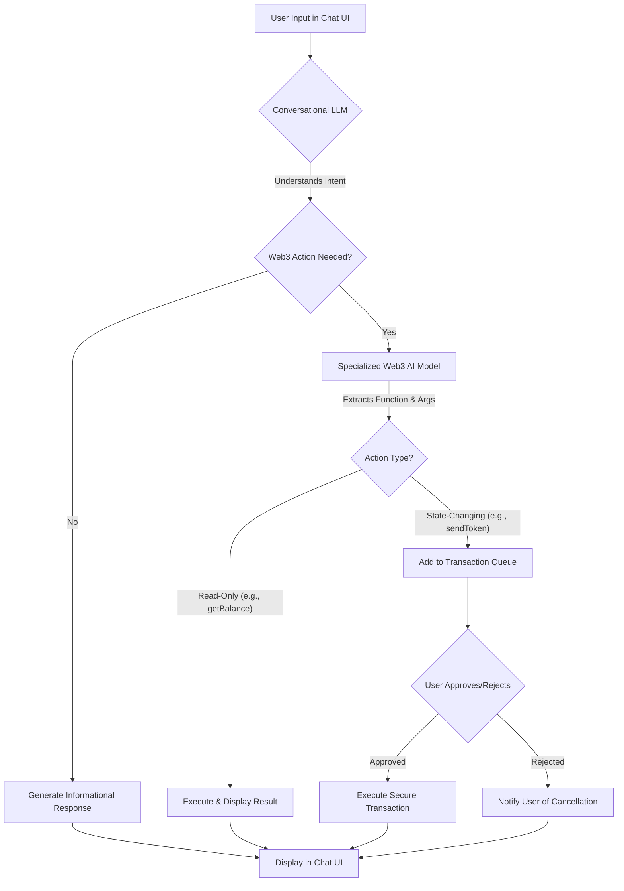

# AxiosChat: Your Intelligent Web3 Navigator

**Python proxy backend (`replicate_py.py`) deployed at:** https://axioschat-sensay.onrender.com

<div align="center">
  
  
  ### *Bridging the gap between complex blockchain technology and everyday users*
</div>

## 🚀 Revolutionizing Your Web3 Experience

**AxiosChat** is a cutting-edge, AI-powered chat interface designed to demystify the complexities of the blockchain. We bridge the gap between the technical world of Web3 and everyday users by enabling seamless interaction with decentralized technologies through intuitive, natural language conversations. Ask questions, execute transactions, and learn about crypto concepts – all within a sleek, responsive, and now **exceptionally robust** chat environment.

<div align="center">
  <table>
    <tr>
      <td><b>The Challenge</b></td>
      <td><b>Our Solution</b></td>
    </tr>
    <tr>
      <td>Web3 presents a steep learning curve with complex jargon, intricate procedures, and fear of errors that create significant barriers to mainstream adoption.</td>
      <td>AxiosChat transforms this landscape by providing a user-friendly gateway to blockchain functionalities, empowering both crypto enthusiasts and newcomers to navigate the decentralized web with confidence.</td>
    </tr>
  </table>
</div>

### 🔗 Live Demo & Pitch

<div align="center">
  <a href="https://axioschat-r2jy.vercel.app/" target="_blank">
    
  </a>
</div>

> **Note:** AI functionality may be limited on the live demo due to API key constraints.

## ✨ Key Features & Recent Enhancements


### 💬 Core Functionality

* **Conversational Blockchain Operations**: Execute transactions (token swaps, transfers) and query data (balances, prices) using simple English.
* **Intelligent Function Calling**: Sophisticated AI determines when to call specific blockchain functions based on your requests.
* **Educational Context**: Learn as you go! AxiosChat provides explanations for blockchain concepts and transaction details.
* **Secure by Design**: Critical operations require user approval via a clear transaction queue, giving you full control.

### 🎨 Enhanced User Interface

* **Dynamic & Engaging**: Animated message bubbles and a visually appealing design with modern gradients.
* **Crystal-Clear Code Formatting**: Improved readability for technical information.
* **User-Friendly Interactions**: Easy message copying and categorized prompt suggestions to guide your exploration.
* **Responsive Design**: Smooth experience across all devices.

### 🛡️ Unprecedented Robustness

* **Graceful Error Handling**: Advanced error boundaries and try-catch blocks prevent UI freezes or crashes.
* **Fallback Mechanisms**: The UI gracefully degrades if optional dependencies (like animation libraries) fail to load, ensuring core functionality remains.
* **Stable Component Architecture**: Refactored key components (`ChatMessages`, `SuggestedPromptsPanel`, `Chat` page) for maximum stability and resilience.

### 🧠 AI Strategy

* **Primary Model - Sensay AI Network**: Leverages the Sensay AI Network as a blockchain-specialized knowledge engine, delivering chat-based Q&A, replica management, and on-chain insights via its `/v1/replicas/{replicaUUID}/chat/completions` and experimental `/v1/experimental/replicas/{replicaUUID}/chat/completions` endpoints.
* **Fallback Model - Gemini**: If a Sensay API key isn't provided or you toggle off Sensay in the UI, the app automatically falls back to Gemini's conversational LLM (`gemini-2.0-flash`) for general-purpose dialogue.
* **Model Switching**: Use the Model Settings panel in the chat UI to switch between Sensay and Gemini at runtime when multiple keys are available.
* **Customizable API Keys**: Configure both `VITE_SENSAY_API_KEY` and `VITE_GEMINI_API_KEY` in your `.env`; the app reads Sensay first then falls back to Gemini.

## 🏆 Why AxiosChat Stands Out

AxiosChat isn't just another chatbot. It's a **thoughtfully engineered solution** addressing a critical pain point in the Web3 ecosystem: **accessibility**.

<div align="center">
  <table>
    <tr>
      <th>Key Strength</th>
      <th>Why It Matters</th>
    </tr>
    <tr>
      <td><b>Innovation in User Experience</b></td>
      <td>We've created an interface that is not only functional but delightful to use, with polished animations, intuitive categorized prompts, and thoughtful visual design.</td>
    </tr>
    <tr>
      <td><b>Technical Excellence & Reliability</b></td>
      <td>Our investment in robust error handling and graceful degradation ensures a seamless user journey even when encountering unexpected issues - a maturity rarely seen in hackathon projects.</td>
    </tr>
    <tr>
      <td><b>Real-World Problem Solving</b></td>
      <td>AxiosChat directly tackles the barriers to Web3 adoption, making complex technology understandable and usable for a broader audience.</td>
    </tr>
    <tr>
      <td><b>Practical Application of AI</b></td>
      <td>We demonstrate a sophisticated, multi-layered AI strategy that intelligently combines different models for optimal performance in a specialized domain.</td>
    </tr>
    <tr>
      <td><b>Clear Vision & Execution</b></td>
      <td>The project showcases a deep understanding of user needs and a strong ability to translate that understanding into a functional and impressive application.</td>
    </tr>
  </table>
</div>

## 🏗️ Architecture & Information Flow

AxiosChat employs a sophisticated dual-model AI architecture:

1. **Conversational LLM (Configurable: Sensay, Gemini)**: Manages the primary user interaction, understands intent, and determines if a Web3-specific action is required.
2. **Specialized Web3 AI Model (Gemini)**: If a Web3 action is needed, this model interprets the request to identify the precise blockchain function and its parameters.

This system intelligently differentiates between:
* **Read-only operations** (e.g., checking a token balance), which can be executed quickly.
* **State-changing operations** (e.g., sending tokens), which are routed to a secure transaction queue for explicit user approval.

<div align="center">
  

</div>

## 💻 Technical Stack Highlights

<div align="center">
  <table>
    <tr>
      <th>Category</th>
      <th>Technologies</th>
    </tr>
    <tr>
      <td>Frontend</td>
      <td>React, TypeScript, Tailwind CSS, Shadcn UI</td>
    </tr>
    <tr>
      <td>State Management</td>
      <td>React Hooks (useState, useEffect, useContext)</td>
    </tr>
    <tr>
      <td>Web3 Interaction</td>
      <td>Wagmi, Ethers.js (via AI service)</td>
    </tr>
    <tr>
      <td>AI Integration</td>
      <td>Custom service layer for interacting with LLMs (OpenAI, Sensay) and specialized Web3 models (Gemini)</td>
    </tr>
    <tr>
      <td>UI Enhancements</td>
      <td>Framer Motion (with fallbacks), React Syntax Highlighter, date-fns</td>
    </tr>
    <tr>
      <td>Error Handling</td>
      <td>Custom React Error Boundaries with graceful UI degradation</td>
    </tr>
  </table>
</div>

## 🚀 Getting Started

1. **Clone the Repository**:
   ```bash
   git clone https://github.com/OkeyAmy/axioschat-sensay.git
   cd axioschat-sensay
   ```

2. **Install Dependencies**:
   ```bash
   npm install
   ```
   *This will install all required packages including UI enhancements like `framer-motion`, `react-syntax-highlighter`, and `date-fns`.*

3. **Configure Environment Variables**:
   Create a `.env` file in the root directory and populate it with your Sensay and Gemini API keys:
   ```env
   VITE_SENSAY_API_KEY=your_sensay_api_key
   VITE_GEMINI_API_KEY=your_gemini_api_key
   ```
   - **Sensay (default)**: used for specialized blockchain Q&A via Sensay AI Network.
   - **Gemini (fallback)**: used if Sensay key is missing or toggled off in the UI.
   After updating the `.env`, restart the development server.

4. **Run the Development Server**:
   ```bash
   npm run dev
   ```
   The application will be available at `http://localhost:8081` or another port if specified.

5. **Configure Python Backend**:
   ```bash
   # Create and activate virtual environment
   python -m venv venv
   source venv/bin/activate  # Linux/MacOS
   # venv\Scripts\activate  # Windows

   # Install dependencies
   pip install -r requirements.txt
   ```

6. **Start Backend Service**:
   ```bash
   python api/replicate_py.py
   ```
   *The backend uses Gemini for function calling, returning responses through the frontend's selected model (Sensay/Gemini) based on user configuration.*

## 🔮 Future Roadmap & Vision

* **Phase 1 (Achieved & Enhanced)**: Core conversational AI, Web3 function calling, robust UI, secure transaction handling, support for Ethereum.
* **Phase 2**: Expansion to additional EVM chains (e.g., Polygon, BNB Chain, Arbitrum) and popular L2s.
* **Phase 3**: Deeper DeFi integrations (e.g., interacting with specific lending protocols, yield aggregators via natural language), NFT management.
* **Phase 4**: Browser extension for in-context Web3 assistance and a dedicated mobile application.

# AxiosChat Replica Management Script

This repository contains a PowerShell script (`create-replica.ps1`) that automates the creation (and replacement) of a Sensay replica named **axioschat_v2** configured as a Web3 tutor.

## What This Script Does
1. Loads environment variables from `.env.local` (e.g., your Sensay API secret).
2. Creates a Sensay user (or reuses the user if already present).
3. Checks for an existing replica with slug `axioschat_v2`:
   - If found, deletes the existing replica.
4. Builds a detailed system prompt tailored for Web3 tutoring, including tone, personality, and knowledge areas.
5. Creates a new replica `axioschat_v2` with:
   - Custom greeting
   - Detailed system prompt (multi-line here-string)
   - LLM configuration (`provider`, `model`, `memoryMode`)

## Prerequisites
- PowerShell 5.1 or newer
- A `.env.local` file in the project root with at least:
  ```ini
  Sensay_API=<your_organization_secret>
  ```

## Usage

1. **Install dependencies / set up `.env.local`**
   Ensure `.env.local` contains your organization secret:
   ```ini
   Sensay_API=9d11df4982be9d6e1c6f7c8f2a23e5cb725f57b94e0b9f4d7b681ddca0f5c675
   ```
   **Test with my API key if you can't get yours**

2. **Run the script**
   ```powershell
   cd C:\Users\admin\Desktop\chat-client-sample
   .\create-replica.ps1
   ```
   The script will output each step, including deletion of any existing replica and creation of the new one.

### Listing Your Available Replicas
For users who simply want to list all replicas in the organization, use:
```powershell
# Set environment variables (if not already set)
$env:ORGANIZATION_SECRET = '<your_org_secret>'
$env:API_VERSION      = '2025-03-25'

# List all replicas
Invoke-RestMethod -Uri 'https://api.sensay.io/v1/replicas' -Method Get `
  -Headers @{
    'X-ORGANIZATION-SECRET' = $env:ORGANIZATION_SECRET;
    'X-API-Version'         = $env:API_VERSION;
    'Content-Type'          = 'application/json'
  } `
| ConvertTo-Json -Depth 10
```

## Customization
If you need to modify the behavior or content of the replica, edit `create-replica.ps1`:
- **Replica identity:**
  - `$replicaBody.name`
  - `$replicaBody.slug`
  - `$replicaBody.shortDescription`
  - `$replicaBody.greeting`
- **System prompt:**
  - The multi-line here-string stored in `$systemPrompt` determines tone, personality, and content scope.
- **LLM configuration:**
  - `provider`, `model`, `memoryMode`, and `systemMessage` under the `llm` block.
- **API version:**
  - Update `$apiVersion` if Sensay releases a new version.

Once edited, re-run:
```powershell
.\create-replica.ps1
```

*This README was generated to document the automated creation and management of Sensay replicas for Web3 tutoring.*

## 📄 License

This project is licensed under the [MIT License](LICENSE).

---

<div align="center">
  <p>
    <i>Built with 💜 for the blockchain community</i>
  </p>
  <p>
    <a href="https://github.com/OkeyAmy/AxiosChat/issues">Report Bug</a> · 
    <a href="https://github.com/OkeyAmy/AxiosChat/issues">Request Feature</a>
  </p>
</div>
